# Enterprise Cloud Platform

A production-modeled secure software supply chain, service mesh, and
observability platform, built on Amazon EKS and operated against a forked
copy of Google's Bank of Anthos. The system is treated throughout as
belonging to a mid-size regulated digital bank — real money moving through
it, a regulator asking questions, but not global-bank scale. That framing is
what justifies the specific tool choices below (Istio, Vault, Kyverno,
Falco) without over-building for a toy project.

This README is deliberately not promotional. It documents what was actually
built, what was actually tested, what broke, and what remains unverified —
see `docs/engineering/technical-debt.md` for the honest gaps.

## Engineering Problem

A team shipping code to customer-facing banking services needs to do it
frequently, without shipping a vulnerable or tampered image, without
unplanned downtime, and with the ability to detect and diagnose an incident
from telemetry alone rather than guessing. The problem is not "can we
deploy" — it is "can we deploy safely, prove what was deployed is what was
intended, and know immediately when something is wrong."

## What Is Actually Built (Implemented, Verified)

Per the project's own phased roadmap, **Phase 1 (Foundations, CI/CD Supply
Chain, GitOps, Service Mesh, Security Hardening)** and **Phase 2
(Observability Stack)** are complete and have been operated, broken, and
fixed against a live cluster across multiple working sessions. **Phases 3
(Chaos Engineering & Disaster Recovery), 4 (AI Infrastructure / GPU
Serving), and 5 (FinOps)** from the original roadmap are explicitly **not
built** — see "Future Work" below. Do not infer their existence from this
document.

| Layer | Tools | Status |
|---|---|---|
| Infrastructure | Terraform, Amazon EKS, VPC/NAT/IAM (IRSA/OIDC) | Implemented, rebuilt from scratch multiple sessions |
| CI/CD Supply Chain | GitHub Actions, Gitleaks, Trivy, Syft, Cosign, OPA/Conftest | Implemented, all gates verified green end to end |
| GitOps Deployment | ArgoCD, Argo Rollouts (canary + automatic rollback) | Implemented; rollback fired for real once, not staged |
| Service Mesh | Istio (mTLS, traffic policy, fault injection) | Implemented; fault injection proven with real timing, mTLS enforcement mode confirmed via config, **not** confirmed via traffic telemetry (see technical debt) |
| Security Hardening | Vault (dev mode), Kyverno (Audit mode), Falco, kube-bench | Implemented; RBAC boundary and NetworkPolicy enforcement independently verified live (see `docs/security/`) |
| Observability | Prometheus, Grafana, Loki, Tempo, OpenTelemetry, Alertmanager | Implemented; Prometheus/Grafana fully API-verified, Loki/Tempo/OTel required an EBS CSI driver install (undocumented dependency, see PM-3) |

## Architecture

```mermaid
flowchart LR
    Dev[Developer commit] --> CI[CI/CD Pipeline]

    subgraph CI["CI/CD Supply Chain"]
        direction TB
        Test[Tests + Static Analysis] --> Secrets[Secret + Dependency Scan]
        Secrets --> Build[Build Image]
        Build --> ImgScan[Image Vuln Scan - Trivy]
        ImgScan --> SBOM[SBOM Generation - Syft]
        SBOM --> Sign[Sign Image - Cosign]
        Sign --> Policy[Policy Gate - OPA/Conftest]
    end

    Policy --> Registry[(GHCR)]
    Registry --> ArgoCD[ArgoCD GitOps Sync]
    ArgoCD --> Canary[Argo Rollouts Canary]

    subgraph Cluster["EKS Cluster"]
        direction TB
        Canary --> Mesh[Istio mTLS / traffic policy]
        Mesh --> App[Bank of Anthos - userservice]
        App --> Security[Vault + Kyverno + Falco]
        App --> Obs[Prometheus + Grafana + Loki + Tempo]
    end

    Obs --> OnCall[On-call / Alertmanager]
```



See `docs/architecture/system-overview.md` for the full component breakdown
and `docs/architecture/architecture-decisions.md` for the ADRs behind every
non-obvious choice.

## Repository Structure

```
terraform/          Infrastructure as code (network, cluster, bootstrap state)
k8s/baseline/        Namespaces, default-deny NetworkPolicy, baseline RBAC
helm-values/          The exact Helm values files actually used for every install
docs/architecture/   System design, ADRs, security architecture
docs/operations/    Runbooks, deployment flow, cost analysis, load testing
docs/reliability/    SLOs, failure-mode results (real drain/PDB tests)
docs/security/       Security controls matrix, supply-chain security detail
docs/incidents/       Full postmortem log (13 real incidents)
docs/engineering/    Debugging history, lessons learned, technical debt
docs/SCREENSHOTS.md   Exact list of evidence screenshots still needed
```

## Operating the Platform

Full bring-up order, rationale, and the WSL2 DNS gotcha that has broken
almost every session start are in `docs/operations/runbook.md` section
"Rebuilding the Cluster From Zero" — read that before running anything.

## Known Limitations

See `docs/engineering/technical-debt.md` for the complete, honest list.
Headline items: Vault runs in dev mode (not durable), Cosign image
signatures are verified in the pipeline but **not enforced at cluster
admission**, mTLS is configured (`PeerAuthentication: STRICT`) but its
enforcement was **not** confirmed via live traffic telemetry (the
`istio_requests_total` metric was absent from Prometheus at test time),
and circuit-breaker/outlier-detection behavior was configured but never
observed firing under real traffic.

## Future Work (Not Implemented — Do Not Assume Otherwise)

- **Phase 3 — Chaos Engineering & Disaster Recovery**: Chaos Mesh/Litmus
  experiments, HA Postgres failover, Velero backup/restore. Not started.
- **Phase 4 — AI Infrastructure**: GPU scheduling, model serving. Not started.
- **Phase 5 — FinOps**: OpenCost/Kubecost, waste detection, forecasting.
  Not started; `docs/operations/cost-analysis.md` uses raw AWS CLI output
  instead, which is a real but far less mature substitute.
- Production-grade Vault (HA, real unseal/storage backend).
- Admission-enforced Cosign signature verification (e.g. Kyverno
  `verifyImages`).
- Demo video recording — a written shot list exists in
  `docs/operations/deployment.md`, the video itself was explicitly out of
  scope for this pass.
